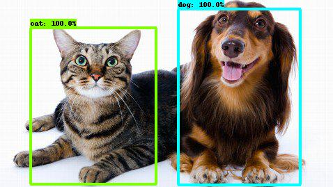
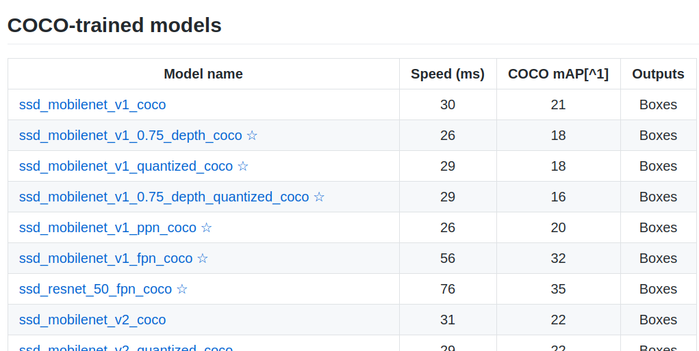

<h1 align = 'center'> 
Implement Tensorflow Object Detection API on Custom Dataset
</h1>
<p align="center">


<br>

<a href="https://codecov.io/gh/trieuphatluu/tf_detection_api">
  
</a>


</p>

---

<p align="center">

</p>

[Tensorflow Object Detection API](https://tensorflow-object-detection-api-tutorial.readthedocs.io/en/latest/training.html) provides a collection of detection models pre-trained on the COCO dataset, the Kitti dataset, the Open Images dataset,etc. These models can be useful for out-of-the-box inference or initializing your models when training on custom datasets. 

Typically, the following steps are required to train on a custom dataset:
<ol> 
    <li> Installation.
    <ul> 
        <li> Anaconda python=3.7 (optional) </li>
        <li> tensorflow 1.15</li>
        <li> Required python packages (i.e., requirements.txt)</li>
        <li> Clone <a href=https://github.com/tensorflow/models> Tensorflow model garden</a> </li>
        <li> Download and install protobuf</li>
    </ul> 
    </li>
    <li>  Prepare custom dataset
    <ul>
        <li>Prepares images (.jpg format)</li>
        <li>Make annotations (.xml format) for each image</li>
        <li>Combine annotation .xml files into a .csv file for train and test set</li>
        <li>Create label map file .pbtxt</li>
        <li>Generate tf records from such datasets</li>
    </ul>
    </li>
    <li>  Download <a href=https://github.com/tensorflow/models/blob/master/research/object_detection/g3doc/detection_model_zoo.md>pre-trained models </a></li>
    <li> Configure training pipeline (e.g., edit pipeline.config file)</li>
    <li> Prepare options and run ```python object_detection/model_main.py``` </li>
</ol> 

This repos aims to process all of the required steps mentioned above in **one bash command**

## :heavy_check_mark: Requirements: 
<ul> 
    <li> Anaconda3 </li>
    <li> Python 3.7 </li>
</ul> 

## :zap: Usage

``` 
bash main.sh --config_file={PATH_TO_CONFIG_FILE}
```

### :question: Help
``` 
main.sh [--install] [--config_file str] [--env str]

Implement tensorflow (tf-gpu 1.15.0) Object Detection API on custom Dataset.

Requirements: Anaconda3, python 3.7

Args:
    -h|--help           Show this help message
    --install           Install conda env, pip requirements, and tf models API.
    --config_file  str  Path to config file.
                        Default: /tf_detection_api/config.json
    --env          str  Conda environment name.
                        Default: tf1
```

## :page_facing_up: Config file
The contents of the config .json file is as belows:
``` 
{
    "image_dir": "PATH_TO_IMAGES_DIRECTORY",
    "anno_dir": "PATH_TO_ANNOTATIONS_DIRECTORY",
    "id":[1,2],
    "name":["cat","dog"],
    "pretrained_model": "ssd_mobilenet_v1_coco",
    "train_ratio":0.75
}
```

 - <code> image_dir</code>: absolute path to the local directory that contains all of the images (both train and test sets). If you plan to download images from google search, Selenium could be a good choice to automate this process. Detailed isntructions can be found in [[4]](#4)

- <code> anno_dir</code>: absolute path to annotations directory that contains .xml annotaiton files. labelImg is a nice tool to generate the annotation .xml file from input images. Details can be found in [[5]](#5)

- <code>id</code>: list of category IDs from your custom dataset. :memo: Note that the id starts from 1 because id=0 is used for background as default.

- <code>name</code>: list of category names from custom dataset

- <code>pretrained_model</code>: pre-trained model name from tensorflow model garden. [Full list of pretrained models](https://github.com/tensorflow/models/blob/master/research/object_detection/g3doc/detection_model_zoo.md)
<p align="center">

</p>

- <code>train_ratio</code>: Ratio to split train and test sets. Default: 0.75

---
## <a id=ref >:clipboard: References </a>
<a id="1">[1]</a> 
Tensorflow model garden installation
https://github.com/tensorflow/models/blob/master/research/object_detection/g3doc/installation.md

<a id="2">[2]</a> 
Setup for custom dataset
https://github.com/tensorflow/models/blob/master/research/object_detection/g3doc/using_your_own_dataset.md

<a id="3">[3]</a> 
Run the traning job
https://github.com/tensorflow/models/blob/master/research/object_detection/g3doc/running_locally.md

<a id="4">[4]</a> 
Search and Download image from google with Python and Selenium
https://towardsdatascience.com/image-scraping-with-python-a96feda8af2d

<a id="5">[5]</a> 
Label images with labelImg tool
https://github.com/tzutalin/labelImg

## Licence
